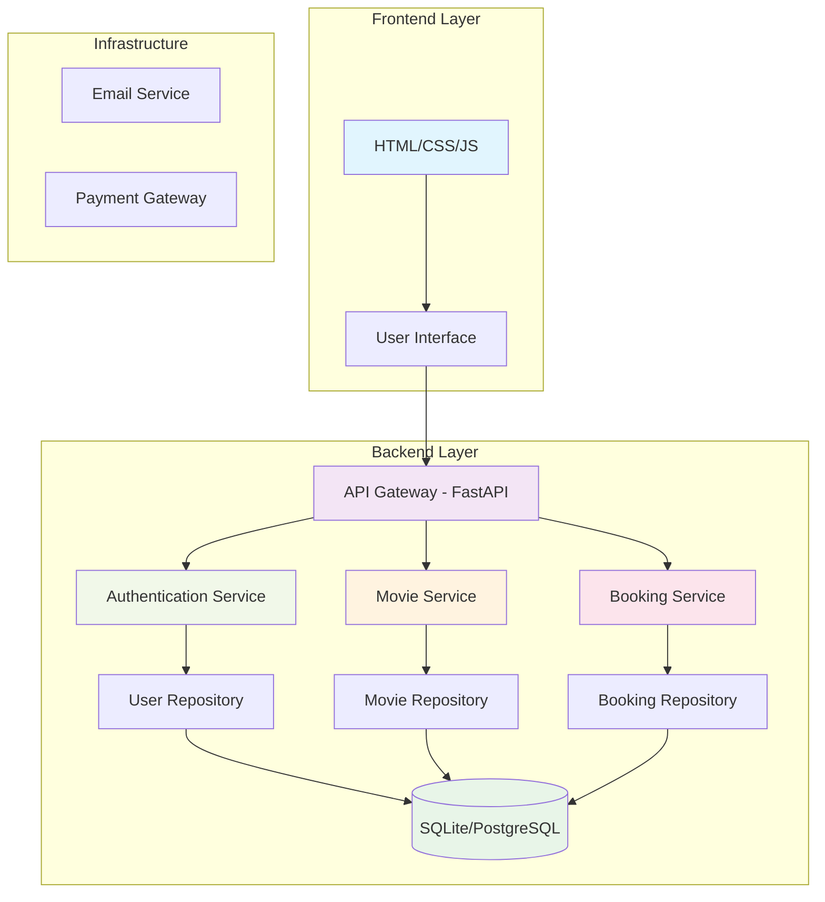

# 🎬 سیستم رزرو بلیط سینما

<div align="center">


**یک سیستم کامل رزرو بلیط سینما با معماری لایه‌ای و طراحی مدرن**

[](https://python.org)
[](https://fastapi.tiangolo.com)
[](https://flask.palletsprojects.com/)
[](https://developer.mozilla.org/en-US/docs/Web/HTML)
[](https://developer.mozilla.org/en-US/docs/Web/CSS)
[](https://developer.mozilla.org/en-US/docs/Web/JavaScript)
[](https://sqlite.org)
[](LICENSE)

</div>

## 📋 فهرست مطالب
- [🎯 معرفی پروژه](#-معرفی-پروژه)
- [✨ ویژگی‌های کلیدی](#-ویژگیهای-کلیدی)
- [🏗️ معماری سیستم](#️-معماری-سیستم)
- [🛠️ تکنولوژی‌های استفاده شده](#️-تکنولوژیهای-استفاده-شده)
- [📁 ساختار پروژه](#-ساختار-پروژه)
- [🚀 راه‌اندازی سریع](#-راهاندازی-سریع)
- [📡 API Documentation](#-api-documentation)
- [🎨 صفحات وب](#-صفحات-وب)
- [👥 اعضای تیم](#-اعضای-تیم)
- [📊 نمودار معماری](#-نمودار-معماری)
- [🤝 مشارکت](#-مشارکت)
- [📄 لایسنس](#-لایسنس)

---

## 🎯 معرفی پروژه

این پروژه یک **سیستم کامل رزرو بلیط سینما** است که امکان مدیریت کاربران، فیلم‌ها، سانس‌ها و رزرو صندلی را فراهم می‌کند. سیستم با **معماری لایه‌ای (Layered Architecture)** طراحی شده تا قابلیت نگهداری، توسعه‌پذیری و خوانایی کد را تضمین کند.

### اهداف پروژه:
- ✅ ایجاد پلتفرمی کاربرپسند برای رزرو آنلاین بلیط
- ✅ پیاده‌سازی مکانیزم امن احراز هویت کاربران
- ✅ مدیریت هوشمند صندلی‌های سالن‌های سینما
- ✅ ارائه داشبورد مدیریتی برای ادمین‌ها
- ✅ استفاده از معماری مدرن و قابل توسعه

---

## ✨ ویژگی‌های کلیدی

### 👤 مدیریت کاربران
- **ثبت‌نام و ورود امن** با JWT Authentication
- **پروفایل کاربری** شخصی‌سازی شده
- **تاریخچه رزروهای** هر کاربر
- **سیستم بازیابی رمز عبور**

### 🎥 مدیریت فیلم‌ها و سانس‌ها
- **نمایش فیلم‌های در حال اکران** با جزئیات کامل
- **اطلاعات هر فیلم** (کارگردان، بازیگران، ژانر، مدت زمان)
- **مدیریت سانس‌های نمایش** با ساعت و قیمت
- **سیستم امتیازدهی و نظر کاربران**

### 💺 سیستم رزرو صندلی
- **نقشه تعاملی سالن سینما**
- **انتخاب آنلاین صندلی** با قفل‌کردن در زمان رزرو
- **نمایش وضعیت صندلی‌ها** (خالی، رزرو شده، انتخاب شده)
- **سیستم کنسلی رزرو** با قوانین مشخص

### 💳 پرداخت و فاکتور
- **درگاه پرداخت آزمایشی**
- **تولید فاکتور الکترونیکی**
- **ارسال تیکت به ایمیل کاربر**
- **سیستم پیگیری رزرو**

### 👨‍💼 پنل مدیریت
- **مدیریت کاربران و نقش‌ها**
- **افزودن و ویرایش فیلم‌ها**
- **گزارش‌گیری از فروش**
- **مشاهده آمار سیستم**

---

## 🏗️ معماری سیستم

این پروژه با **معماری لایه‌ای سه‌لایه** پیاده‌سازی شده:

### لایه‌های معماری:
```
┌─────────────────────────────────────────┐
│          Presentation Layer             │ ← رابط کاربری + API Endpoints
├─────────────────────────────────────────┤
│         Business Logic Layer            │ ← منطق کسب‌وکار + سرویس‌ها
├─────────────────────────────────────────┤
│           Data Access Layer             │ ← دسترسی به داده‌ها + Repository
├─────────────────────────────────────────┤
│          Infrastructure Layer           │ ← دیتابیس + سرویس‌های خارجی
└─────────────────────────────────────────┘
```

### مزایای معماری لایه‌ای در این پروژه:
1. **تفکیک مسئولیت‌ها**: هر لایه مسئولیت مشخصی دارد
2. **قابلیت نگهداری**: تغییر در یک لایه بر لایه‌های دیگر تأثیر کمی دارد
3. **قابلیت تست**: امکان تست واحد هر لایه به صورت مجزا
4. **قابلیت استفاده مجدد**: لایه Business Logic می‌تواند توسط چندین رابط استفاده شود
5. **امنیت**: اعتبارسنجی در هر لایه انجام می‌شود

---

## 🛠️ تکنولوژی‌های استفاده شده

### 🔧 بک‌اند (Backend)
| تکنولوژی | نسخه | توضیحات |
|----------|------|---------|
| **Python** | 3.8+ | زبان اصلی برنامه‌نویسی سمت سرور |
| **FastAPI** | 0.100+ | فریمورک سریع و مدرن برای API های REST |
| **Flask** | 2.3+ | میکروفریمورک برای Authentication |
| **SQLAlchemy** | 1.4+ | ORM قدرتمند برای کار با دیتابیس |
| **JWT** | python-jose | احراز هویت مبتنی بر توکن |
| **Bcrypt** | passlib | هش کردن امن رمزهای عبور |

### 🎨 فرانت‌اند (Frontend)
| تکنولوژی | توضیحات |
|----------|---------|
| **HTML5** | ساختار صفحات وب |
| **CSS3** | استایل‌دهی و طراحی ظاهری |
| **JavaScript (ES6+)** | منطق تعاملی سمت کلاینت |
| **Font Awesome** | آیکون‌های زیبا |
| **Google Fonts** | فونت‌های فارسی و انگلیسی |

### 🗄️ پایگاه داده
| تکنولوژی | توضیحات |
|----------|---------|
| **SQLite** | پایگاه داده سبک برای توسعه |
| **PostgreSQL** | آماده برای محیط عملیاتی |
| **JSON Files** | ذخیره‌سازی موقت داده‌های استاتیک |

### 🚀 ابزارهای توسعه
| تکنولوژی | توضیحات |
|----------|---------|
| **Git** | سیستم کنترل نسخه |
| **VS Code** | محیط توسعه یکپارچه |
| **Postman** | تست API ها |
| **pytest** | فریمورک تست واحد |

---

## 📁 ساختار پروژه

```bash
cinema-reservation/
│
├── 📁 frontend/                    # بخش فرانت‌اند
│   ├── 📁 css/                     # استایل‌های صفحات
│   │   ├── style.css              # استایل اصلی
│   │   ├── main.css               # استایل صفحه اصلی
│   │   ├── movies.css             # استایل صفحه فیلم‌ها
│   │   ├── booking.css            # استایل صفحه رزرو
│   │   ├── login.css              # استایل صفحه ورود
│   │   ├── register.css           # استایل صفحه ثبت‌نام
│   │   ├── dashboard.css          # استایل داشبورد
│   │   ├── profile.css            # استایل پروفایل
│   │   ├── contact.css            # استایل تماس با ما
│   │   ├── slider.css             # استایل اسلایدر
│   │   └── fonts.css              # فونت‌های پروژه
│   │
│   ├── 📁 js/                      # اسکریپت‌های جاوااسکریپت
│   │   ├── main.js                # اسکریپت اصلی
│   │   ├── auth.js                # مدیریت احراز هویت
│   │   ├── booking.js             # منطق رزرو بلیط
│   │   ├── movies.js              # مدیریت فیلم‌ها
│   │   ├── dashboard.js           # منطق داشبورد
│   │   ├── profile.js             # مدیریت پروفایل
│   │   ├── contact.js             # فرم تماس با ما
│   │   ├── slider.js              # اسلایدر صفحه اصلی
│   │   └── global.js              # توابع عمومی
│   │
│   ├── 📁 images/                  # تصاویر و آیکون‌ها
│   │   ├── 📁 backgrounds/         # تصاویر پس‌زمینه
│   │   ├── 📁 movies/              # پوستر فیلم‌ها
│   │   ├── 📁 profile/             # تصاویر پروفایل
│   │   ├── 📁 slider/              # تصاویر اسلایدر
│   │   ├── 📁 picture/             # تصاویر دیگر
│   │   └── logo.png                # لوگوی پروژه
│   │
│   ├── 📁 new images/              # تصاویر اضافی
│   │
│   ├── index.html                  # صفحه اصلی
│   ├── movies.html                 # صفحه فیلم‌ها
│   ├── booking.html                # صفحه رزرو بلیط
│   ├── login.html                  # صفحه ورود
│   ├── register.html               # صفحه ثبت‌نام
│   ├── dashboard.html              # داشبورد کاربر
│   ├── profile.html                # پروفایل کاربر
│   ├── contact.html                # تماس با ما
│   ├── movies.json                 # داده‌های فیلم‌ها
│   ├── bookings.json               # داده‌های رزروها
│   └── seats.json                  # داده‌های صندلی‌ها
│
├── 📁 backend/                     # بخش بک‌اند (معماری لایه‌ای)
│   ├── main.py                     # نقطه شروع FastAPI
│   ├── simple_flask_auth.py        # احراز هویت با Flask
│   ├── requirements.txt            # وابستگی‌های پایتون
│   ├── .env.example               # الگوی متغیرهای محیطی
│   ├── init_db.py                 # راه‌اندازی دیتابیس
│   │
│   ├── 📁 api/                     # لایه Presentation
│   │   ├── 📁 routes/              # مسیرهای API
│   │   │   ├── auth.py            # مسیرهای احراز هویت
│   │   │   ├── bookings.py        # مسیرهای رزرو
│   │   │   └── movies.py          # مسیرهای فیلم‌ها
│   │   │
│   │   └── 📁 middlewares/         # میان‌افزارها
│   │       └── auth_middleware.py # میان‌افزار احراز هویت
│   │
│   ├── 📁 services/                # لایه Business Logic
│   │   ├── auth_service.py        # سرویس احراز هویت
│   │   ├── booking_service.py     # سرویس رزرو
│   │   └── movie_service.py       # سرویس فیلم‌ها
│   │
│   ├── 📁 models/                  # لایه Domain
│   │   ├── user.py                # مدل کاربر
│   │   ├── movie.py               # مدل فیلم
│   │   ├── booking.py             # مدل رزرو
│   │   └── showtime.py            # مدل سانس
│   │
│   ├── 📁 repositories/            # لایه Data Access
│   │   ├── user_repository.py     # دسترسی به داده کاربران
│   │   ├── booking_repository.py  # دسترسی به داده رزروها
│   │   └── movie_repository.py    # دسترسی به داده فیلم‌ها
│   │
│   ├── 📁 schemas/                 # схемы Pydantic
│   │   ├── auth.py                # схемы احراز هویت
│   │   ├── booking.py             # схемы رزرو
│   │   └── movie.py               # схемы فیلم‌ها
│   │
│   ├── 📁 database/                # لایه Infrastructure
│   │   ├── database.py            # تنظیمات دیتابیس
│   │   └── 📁 migrations/         # فایل‌های مهاجرت
│   │
│   ├── 📁 config/                  # تنظیمات برنامه
│   │   └── settings.py            # تنظیمات اصلی
│   │
│   ├── 📁 utils/                   # ابزارهای کمکی
│   │   ├── security.py            # ابزارهای امنیتی
│   │   ├── validators.py          # اعتبارسنجی داده‌ها
│   │   └── helpers.py             # توابع کمکی
│   │
│   └── 📁 tests/                   # تست‌های واحد
│       ├── test_auth.py           # تست‌های احراز هویت
│       └── test_booking.py        # تست‌های رزرو
│
├── .gitignore                     # فایل‌های نادیده گرفته شده توسط Git
├── README.md                      # این فایل
└── LICENSE                        # مجوز پروژه
```

---

## 🚀 راه‌اندازی سریع

### پیش‌نیازها
- Python 3.8 یا بالاتر
- pip (مدیریت پکیج‌های پایتون)
- Git

### مراحل نصب

#### 1. کلون کردن ریپازیتوری
```bash
git clone https://github.com/HosseinMpa/software-project.git
cd software-project
```

#### 2. راه‌اندازی فرانت‌اند
```bash
# فقط کافیست فایل index.html را در مرورگر باز کنید
# یا از Live Server در VS Code استفاده کنید
```

#### 3. راه‌اندازی بک‌اند
```bash
# وارد پوشه backend شوید
cd backend

# ایجاد محیط مجازی (اختیاری اما توصیه می‌شود)
python -m venv venv

# فعال کردن محیط مجازی
# ویندوز:
venv\Scripts\activate
# لینوکس/مک:
source venv/bin/activate

# نصب وابستگی‌ها
pip install -r requirements.txt

# راه‌اندازی دیتابیس
python init_db.py

# اجرای سرور FastAPI
uvicorn main:app --reload --host 0.0.0.0 --port 8000

# یا اجرای سرور Flask برای Authentication
python simple_flask_auth.py
```

#### 4. دسترسی به سیستم
- **Frontend**: http://localhost:5500 (با Live Server)
- **Backend API**: http://localhost:8000
- **API Documentation**: http://localhost:8000/docs
- **Flask Auth**: http://localhost:5000

---

## 📡 API Documentation

### Authentication Endpoints 🔐
| روش | مسیر | توضیحات |
|-----|------|---------|
| **POST** | `/api/auth/register` | ثبت‌نام کاربر جدید |
| **POST** | `/api/auth/login` | ورود کاربر |
| **GET** | `/api/auth/me` | دریافت اطلاعات کاربر جاری |
| **PUT** | `/api/auth/change-password` | تغییر رمز عبور |
| **POST** | `/api/auth/logout` | خروج کاربر |

### Movie Endpoints 🎥
| روش | مسیر | توضیحات |
|-----|------|---------|
| **GET** | `/api/movies` | دریافت لیست فیلم‌ها |
| **GET** | `/api/movies/{id}` | دریافت جزئیات یک فیلم |
| **GET** | `/api/movies/{id}/showtimes` | دریافت سانس‌های فیلم |
| **POST** | `/api/movies` | افزودن فیلم جدید (Admin) |

### Booking Endpoints 💺
| روش | مسیر | توضیحات |
|-----|------|---------|
| **POST** | `/api/bookings` | ایجاد رزرو جدید |
| **GET** | `/api/bookings` | دریافت رزروهای کاربر |
| **GET** | `/api/bookings/{id}` | دریافت جزئیات رزرو |
| **DELETE** | `/api/bookings/{id}` | لغو رزرو |

### Health & Info 🩺
| روش | مسیر | توضیحات |
|-----|------|---------|
| **GET** | `/` | اطلاعات API |
| **GET** | `/health` | بررسی سلامت سیستم |

---

## 🎨 صفحات وب

### صفحه اصلی (`index.html`)
- اسلایدر فیلم‌های ویژه
- نمایش فیلم‌های در حال اکران
- ویژگی‌های سیستم
- آمار و ارقام

### صفحه فیلم‌ها (`movies.html`)
- شبکه‌ای از فیلم‌های در حال اکران
- فیلتر بر اساس ژانر
- جستجوی فیلم‌ها
- لینک مستقیم به رزرو

### صفحه رزرو (`booking.html`)
- انتخاب فیلم
- انتخاب سانس
- نقشه تعاملی سالن سینما
- انتخاب صندلی
- خلاصه رزرو و پرداخت

### احراز هویت (`login.html`, `register.html`)
- فرم ورود با نام کاربری/رمز عبور
- فرم ثبت‌نام با اعتبارسنجی
- بازیابی رمز عبور

### پروفایل کاربر (`profile.html`)
- نمایش اطلاعات کاربر
- تاریخچه رزروها
- ویرایش اطلاعات شخصی

### داشبورد (`dashboard.html`)
- آمار کلی سیستم
- نمودارهای فروش
- مدیریت کاربران (برای ادمین)

---

## 👥 اعضای تیم

| نام | مسئولیت | بخش |
|-----|---------|------|
| **حسین محمدپور و محمد قویدل حیدری** | توسعه‌دهنده فرانت‌اند | رابط کاربری، طراحی صفحات |
| **حسین محمدپور** | توسعه‌دهنده بک‌اند | ماژول رزرو بلیط |
| **محمد قویدل حیدری** | توسعه‌دهنده بک‌اند | ماژول احراز هویت |

---

## 📊 نمودار معماری



---

## 🤝 مشارکت

مشارکت در این پروژه بسیار مورد استقبال است! برای مشارکت:

### راه‌های مشارکت:
1. گزارش باگ یا پیشنهاد قابلیت جدید
2. بهبود مستندات
3. ارسال Pull Request

### دستورالعمل مشارکت:
```bash
# 1. Fork ریپازیتوری
# 2. ایجاد Branch جدید
git checkout -b feature/AmazingFeature

# 3. Commit تغییرات
git commit -m 'Add some AmazingFeature'

# 4. Push به Branch
git push origin feature/AmazingFeature

# 5. ایجاد Pull Request
```

---


<div align="center">

## 📞 تماس با ما

**حسین محمدپور** - 
**محمد قویدل حیدری** -
📧 Email: hossein.mohammadpour@example.com  
🔗 GitHub: [@HosseinMpa](https://github.com/HosseinMpa)  

📧 Email: ghavidelheidarei81@gmail.com  
🔗 GitHub: (https://github.com/CodeCrafter812025)


با تشکر از بررسی این پروژه 😊


